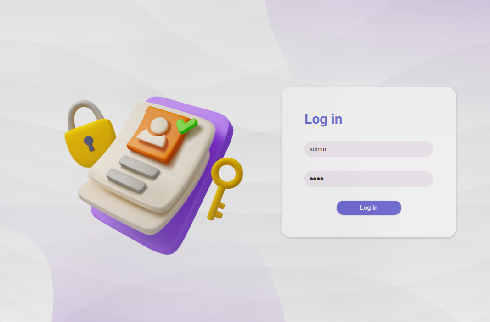
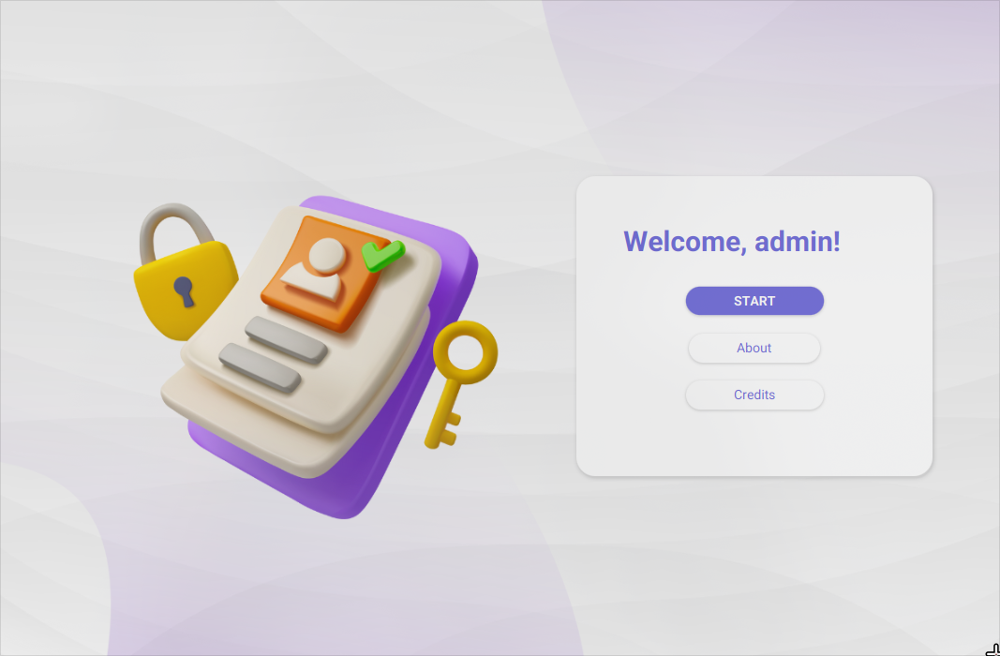
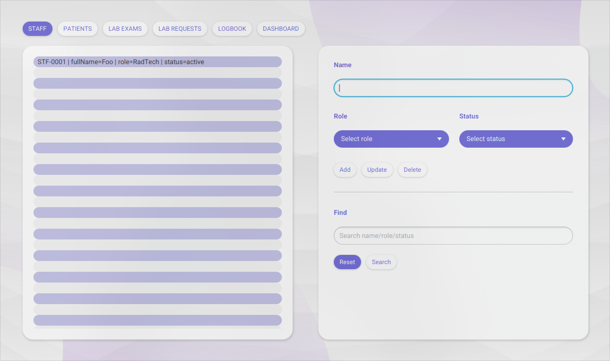
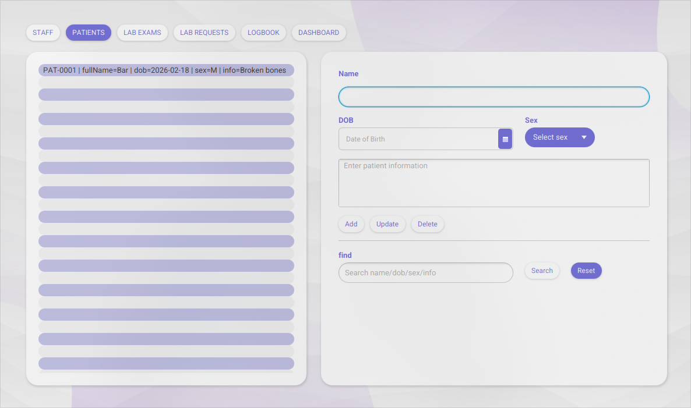
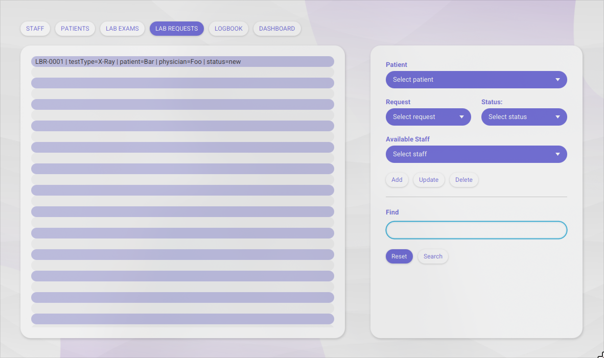
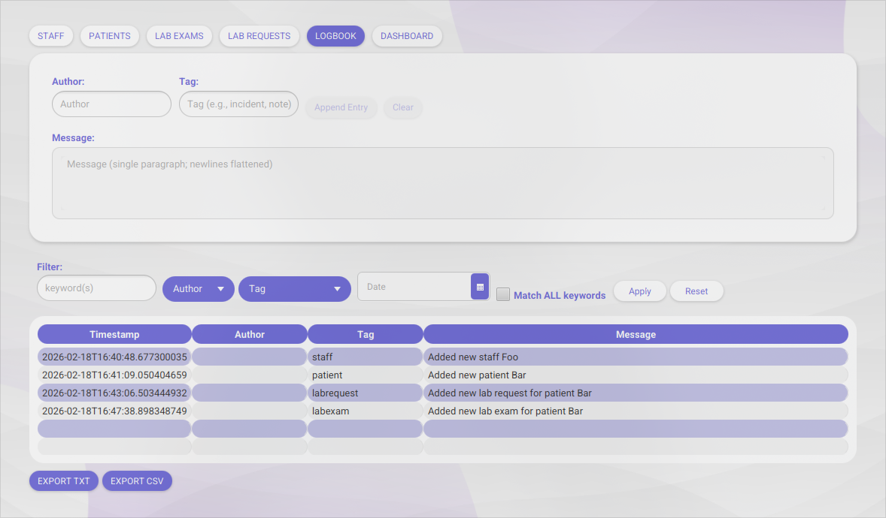
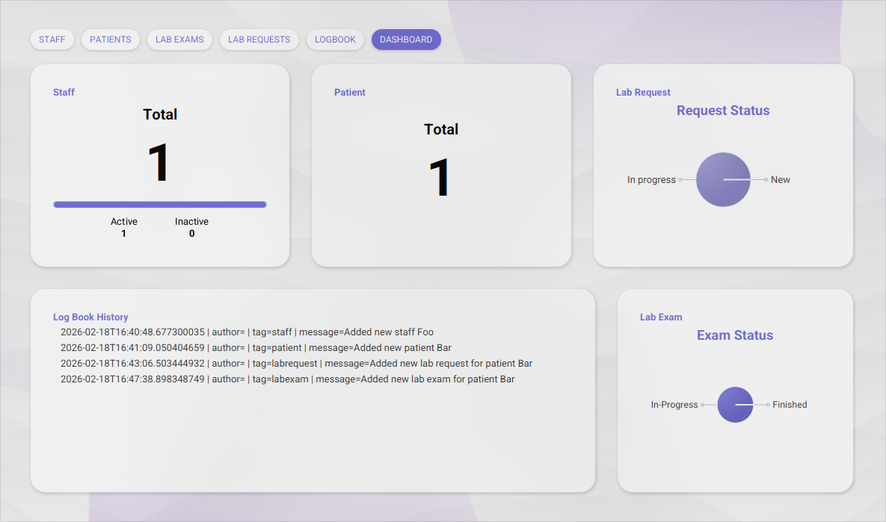

  
  

# Hospital Logbook System

The Hospital Logbook System is a desktop application built with JavaFX for managing hospital operations. It allows staff to record and manage employees, patients, laboratory requests, and laboratory exams — which are automatically captured in a logbook. Lastly, a built-in dashboard gives users a summary of data from all classes, making it easy to monitor the current state of operations.

## Installation

    git clone https://github.com/francogabrieloliveros/hospital_logbook_system.git

make sure to run the program with JavaSE-21 and JavaFX SDK 21 for a smooth setup.

## Usage

### Login Page

The login in page will greet you first. By default, the username is **admin** and the password is **1234**.

### Welcome Page

The welcome page is provides you with the options to view the about page and credits page. The about page shows the purpose of the project and technologies used. On the other hand, the credits page displays the authors of the project as well as asset sources. Click the **start** button to initiate the program.

### Staff Page

The staff page has two main panels. The left panel displays the current registered staff in the system and their information (id, name, role, status). The right panel is where you can add more staff. Moreover, the bottom part of the right panel is a search bar where you can choose to display only a few staffs depending on the search query.

### Patients Page

The patients page has the similar two panel display. Patients can contain information name, date of birth, sex, and personal info. A search option is also present where you can choose to display selected patients based on the query.

### Lab Requests Page

In the lab requests page, you can create a request for the patients that have been added. Depending on the selected request, the available staff dropdown will only show active staffs. Afterwards, you can set the status of the request (new, in progress, done).

### Lab Exams Page

Created lab requests that are new or in-progress will be selectable in the lab exams page. Depending on the selected request, the performing staff dropdown will only show active staffs that specialize in the field of the selected request. Date, results and remarks, as well as status can also be set. Exams that are cancelled or finished automatically set the request to done — in which case, both the exam and request information will be locked and uneditable.

### Logbook Page

All actions that are made in other pages are automatically logged and can be seen in the logbook page. However, option to manually add a log is also present. There are also filtering options if you want to search for a specific set of logs. Lastly, you can also export the logs as a txt or csv file anywhere in your file system.

### Dashboard Page

The summary of information from all the previous pages can be seen in the dashboard page. This gives a much easier to look at one-look graphical interface for the user.

## Additional Notes

- The local name of the program might be different from the repository name, as it was previously named for a university project.
- In case of errors, please make sure that you are running the program with JavaSE21 and JavaFXSDK21. Other versions may have deprecated or non-existent functionalities that is used by this program.
- The option to add credentials in the login page is not yet present.
- The data made with the program are persistent. All classes made with the interface will be stored in **src/storage/\*.txt** files, which is used by the program to save and restore data inputs by the user.
- All actions made by the user are automatically logged and can be seen in the logbook page.
